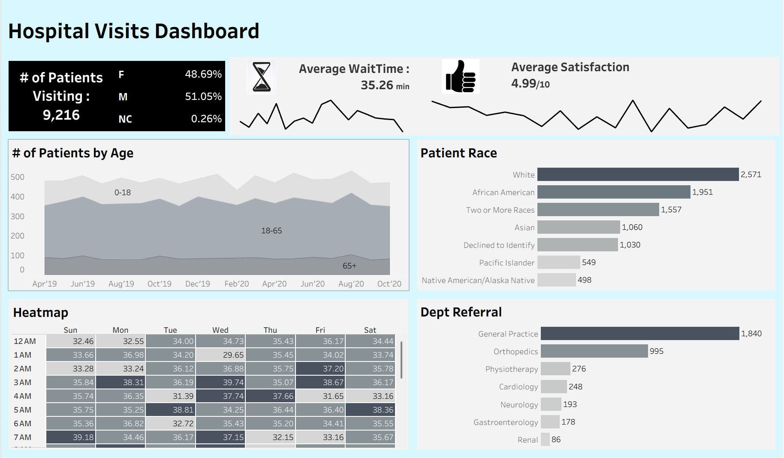

# 🏥 Hospital Visits Dashboard

A comprehensive Tableau dashboard analyzing **9,216 Emergency Room patient visits**, uncovering insights around wait times, patient demographics, satisfaction scores, and department referrals.

---

## 📊 Dashboard Preview



---

## 🔍 Project Overview

This project explores hospital ER data to help healthcare administrators and analysts understand patient flow, identify bottlenecks, and improve patient experience. The dashboard was built entirely in **Tableau Desktop** using real-world structured data.

---

## 💡 Key Insights

- **9,216 total patients** visited the ER, with a near-equal gender split (M: 51.05%, F: 48.69%)
- **Average wait time** of **35.26 minutes** across all visits
- **Average satisfaction score** of **4.99 / 10**, indicating room for improvement
- The **18–65 age group** dominates patient volume across all time periods
- **White (2,571)** and **African American (1,951)** patients make up the largest racial groups
- **General Practice (1,840)** is by far the most referred department, followed by Orthopedics (995)
- The **heatmap** reveals wait time patterns across days of the week and hours — useful for staffing decisions

---

## 🛠️ Tools & Technologies

| Tool | Purpose |
|------|---------|
| Tableau Desktop | Dashboard design & visualization |
| Microsoft Excel / CSV | Data source (`Hospital ER.csv`) |

---

## 📁 Project Structure

```
Hospital visits Dashboard/
│
├── Hospital ER.csv          # Raw dataset (717 KB)
├── Hospital visits.twb      # Tableau workbook file
├── dashboard_screenshot.png # Dashboard preview image
└── README.md                # Project documentation
```

---

## 📌 Visualizations Included

- **KPI Cards** — Total patients, Average Wait Time, Average Satisfaction
- **Patients by Age** — Area chart segmented by age groups (0–18, 18–65, 65+) over time
- **Patient Race** — Horizontal bar chart showing racial demographic breakdown
- **Heatmap** — Wait times by day of week × hour of day
- **Dept Referral** — Bar chart of referring departments by patient volume

---

## 🚀 How to Open

1. Download or clone this repository
2. Open `Hospital visits.twb` in **Tableau Desktop**
3. Ensure `Hospital ER.csv` is in the same folder (data source path may need re-linking)

---

## 👤 Author

**Your Name**
- 💼 [LinkedIn](https://linkedin.com/in/your-profile)
- 🐙 [GitHub](https://github.com/your-username)

---

> 📌 *This project was built as part of my Data Analyst portfolio. Open to Data Analyst & Data Engineering opportunities!*
